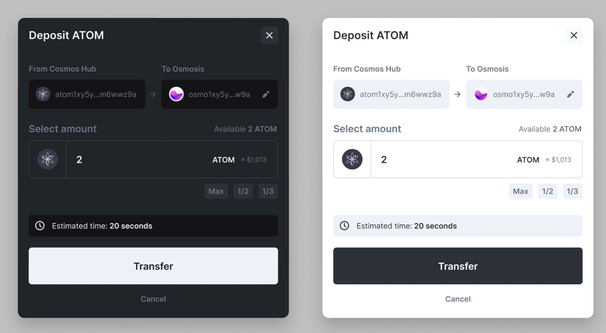

# UI Challenge

## Deliverables

Local testing

```javascript
  npm i
  npm run start
```

Screenshots
- Styled component `Card` with `dark` and `light` themes.


- Components structure and `ThemeProvider`


## Target

Make an UI Component as follows



## Notes

- Using `Styled Component` only. Don't use any UI Kit.
- `Theme` is optional.
- Static component. No need to add functionalities.
